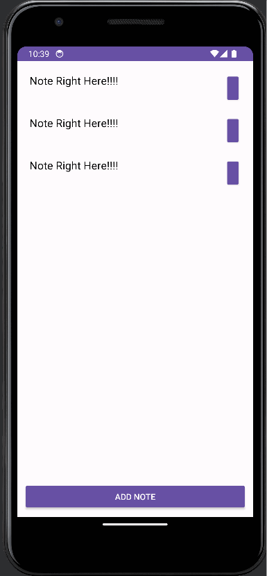

# Notes Project

This is a note app made in Android Studio with Kotlin. Create a new note.

## Functionality 

The following **required** functionality is completed:

* [ ] User can open screen to see a list of notes.
* [ ] User can click button to create a new note.
* [ ] User can type title of note.
* [ ] User can type words into the note.

The following **extensions** are implemented:

* User can press save button to go back to main screen.
* User can see notes on the main screen.

## Video Walkthrough

Here's a walkthrough of implemented user stories:

GIF created with [LiceCap](http://www.cockos.com/licecap/).

## Notes

A lot going on in my time right now with work and midterms, so I was not able to fully complete the app, much to my own dismay. Can write a new note, but no ability to save note.

## License

    Copyright [2023] [Tristan Dearborn]

    Licensed under the Apache License, Version 2.0 (the "License");
    you may not use this file except in compliance with the License.
    You may obtain a copy of the License at

        http://www.apache.org/licenses/LICENSE-2.0

    Unless required by applicable law or agreed to in writing, software
    distributed under the License is distributed on an "AS IS" BASIS,
    WITHOUT WARRANTIES OR CONDITIONS OF ANY KIND, either express or implied.
    See the License for the specific language governing permissions and
    limitations under the License.
